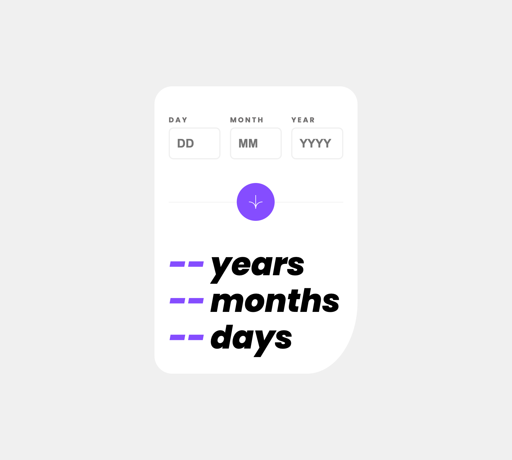

# Frontend Mentor - Age calculator app solution

This is a solution to the [Age calculator app challenge on Frontend Mentor](https://www.frontendmentor.io/challenges/age-calculator-app-dF9DFFpj-Q). Frontend Mentor challenges help you improve your coding skills by building realistic projects.

## Table of contents

- [Overview](#overview)
  - [The challenge](#the-challenge)
  - [Screenshot](#screenshot)
  - [Links](#links)
- [My process](#my-process)
  - [Built with](#built-with)
  - [What I learned](#what-i-learned)
  - [Continued development](#continued-development)
  - [Useful resources](#useful-resources)
- [Author](#author)

## Overview

### The challenge

Users should be able to:

- View an age in years, months, and days after submitting a valid date through the form
- Receive validation errors if:
  - Any field is empty when the form is submitted
  - The day number is not between 1-31
  - The month number is not between 1-12
  - The year is in the future
  - The date is invalid e.g. 31/04/1991 (there are 30 days in April)
- View the optimal layout for the interface depending on their device's screen size
- See hover and focus states for all interactive elements on the page

### Screenshot

### Links

- Solution URL: [GitHub repository](https://github.com/raulgaliciab/age-calculator-app)
- Live Site URL: [Vercel](https://age-calculator-app-blush-iota.vercel.app/)

## My process

### Built with

- Vite
- DOM Manipulation
- ES Modules
- TypeScript
- [Tempo](https://tempo.formkit.com/) - JS Library for date handleling
- Mobile-first workflow
- CSS pseudo classes

### What I learned

- Development using Vite
- How to handle dates in JavaScript
- The use of a JS library (Tempo)
- First time using TypeScript
- Input validation using JavaScript/TypeScript

### Continued development

- Better understanding of Vite and config files
- Continue practicing with Date methods
- Trunk-based development

### Useful resources

- [Date object in JavaScript](https://developer.mozilla.org/en-US/docs/Web/JavaScript/Reference/Global_Objects/Date) - Knowing how the Date object and its methods works was enlightening.

## Author

- Raúl Galicia
- Frontend Mentor - [@yourusername](https://www.frontendmentor.io/profile/raulgaliciab)
